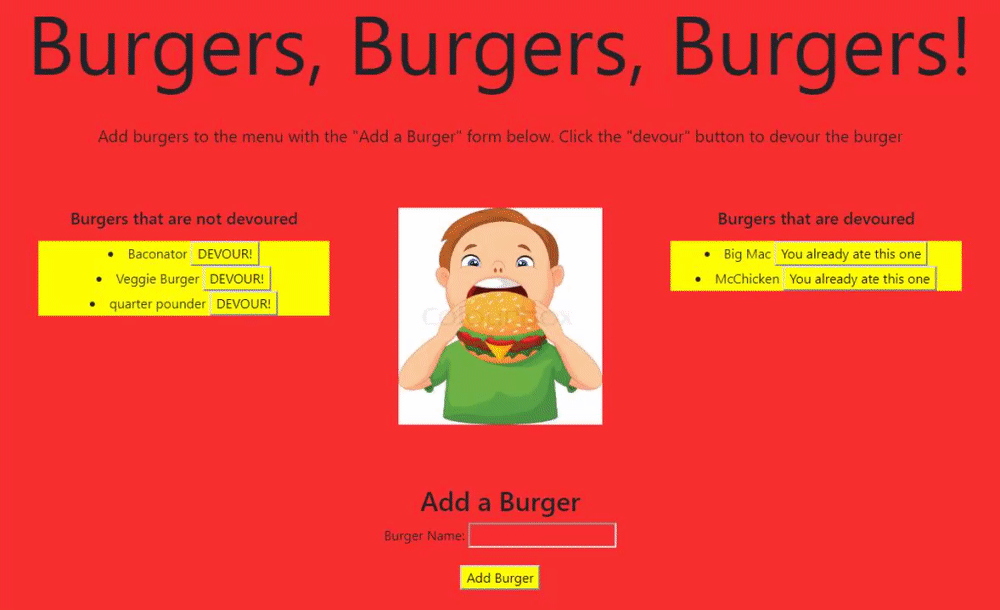

# Unit 13: Node Express Handlebars

## Deployed Link

The deployed heroku link to the application can [be accessed here](https://shielded-coast-50124.herokuapp.com/)

## Description

Node.js web application for creating and eating burgers

## Table of Contents

* [Installation](#Installation)
* [Usage](#Usage)
* [License](#License)
* [Dependencies](#Dependencies)
* [Contributions](#Contributions)
* [Tests](#Tests)
* [Questions](#Questions)

## Installation

If you're using the deployed link at the top of this README to run the application, there are no installation requirements.

If you're running this application on your local machine, make sure that you've downloaded [Node.js from the nodejs.org website](https://nodejs.org/en/download/), then run the following command in the working directory of this project to install the necessary node modules

```sh
npm install
```

Also, make sure that you've downloaded [MySQL from dev.mysql.com](https://dev.mysql.com/downloads/windows/installer/8.0.html) for your particular OS and installed the MySQL workbench along with it.

## Usage

Note: if using the deployed link at the top of this README to run the program, you can use the app right away. The following instructions are only for the case in which you are hosting and running the app on your local machine.

### Instructions for usage on local machine
In order to run the program, first copy the schema.sql file into your MySQL workbench and generate a database by hitting the lightning bolt on the top of the window. Then type the following command into your command line with this project in your current working directory in order to run the application.

```sh
node server.js
```

Your terminal will display the local host port that the app is now running on. Navigate to that local host port in your browser to use the application.

## License


## Dependencies

List of dependency statuses for all packages used in this project

* npm express-handlbars 
* npm mysql 
* npm express 

## Contributions

The following in a copy of the [Contributor Covenant v2.0](https://www.contributor-covenant.org/). Please read before contributing to understand contribution guidelines.

### Our Pledge

We as members, contributors, and leaders pledge to make participation in our
community a harassment-free experience for everyone, regardless of age, body
size, visible or invisible disability, ethnicity, sex characteristics, gender
identity and expression, level of experience, education, socio-economic status,
nationality, personal appearance, race, religion, or sexual identity
and orientation.

We pledge to act and interact in ways that contribute to an open, welcoming,
diverse, inclusive, and healthy community.

### Our Standards

Examples of behavior that contributes to a positive environment for our
community include:

* Demonstrating empathy and kindness toward other people
* Being respectful of differing opinions, viewpoints, and experiences
* Giving and gracefully accepting constructive feedback
* Accepting responsibility and apologizing to those affected by our mistakes,
  and learning from the experience
* Focusing on what is best not just for us as individuals, but for the
  overall community

Examples of unacceptable behavior include:

* The use of sexualized language or imagery, and sexual attention or
  advances of any kind
* Trolling, insulting or derogatory comments, and personal or political attacks
* Public or private harassment
* Publishing others' private information, such as a physical or email
  address, without their explicit permission
* Other conduct which could reasonably be considered inappropriate in a
  professional setting

### Enforcement Responsibilities

Community leaders are responsible for clarifying and enforcing our standards of
acceptable behavior and will take appropriate and fair corrective action in
response to any behavior that they deem inappropriate, threatening, offensive,
or harmful.

Community leaders have the right and responsibility to remove, edit, or reject
comments, commits, code, wiki edits, issues, and other contributions that are
not aligned to this Code of Conduct, and will communicate reasons for moderation
decisions when appropriate.

### Scope

This Code of Conduct applies within all community spaces, and also applies when
an individual is officially representing the community in public spaces.
Examples of representing our community include using an official e-mail address,
posting via an official social media account, or acting as an appointed
representative at an online or offline event.

### Enforcement

Instances of abusive, harassing, or otherwise unacceptable behavior may be
reported to the community leaders responsible for enforcement at
sbarrow825@berkeley.edu

All complaints will be reviewed and investigated promptly and fairly.

All community leaders are obligated to respect the privacy and security of the
reporter of any incident.

#### Enforcement Guidelines

Community leaders will follow these Community Impact Guidelines in determining
the consequences for any action they deem in violation of this Code of Conduct:

#### 1. Correction

**Community Impact**: Use of inappropriate language or other behavior deemed
unprofessional or unwelcome in the community.

**Consequence**: A private, written warning from community leaders, providing
clarity around the nature of the violation and an explanation of why the
behavior was inappropriate. A public apology may be requested.

#### 2. Warning

**Community Impact**: A violation through a single incident or series
of actions.

**Consequence**: A warning with consequences for continued behavior. No
interaction with the people involved, including unsolicited interaction with
those enforcing the Code of Conduct, for a specified period of time. This
includes avoiding interactions in community spaces as well as external channels
like social media. Violating these terms may lead to a temporary or
permanent ban.

#### 3. Temporary Ban

**Community Impact**: A serious violation of community standards, including
sustained inappropriate behavior.

**Consequence**: A temporary ban from any sort of interaction or public
communication with the community for a specified period of time. No public or
private interaction with the people involved, including unsolicited interaction
with those enforcing the Code of Conduct, is allowed during this period.
Violating these terms may lead to a permanent ban.

#### 4. Permanent Ban

**Community Impact**: Demonstrating a pattern of violation of community
standards, including sustained inappropriate behavior,  harassment of an
individual, or aggression toward or disparagement of classes of individuals.

**Consequence**: A permanent ban from any sort of public interaction within
the community.

### Attribution

This Code of Conduct is adapted from the [Contributor Covenant][homepage],
version 2.0, available at
https://www.contributor-covenant.org/version/2/0/code_of_conduct.html.

Community Impact Guidelines were inspired by [Mozilla's code of conduct
enforcement ladder](https://github.com/mozilla/diversity).

[homepage]: https://www.contributor-covenant.org

For answers to common questions about this code of conduct, see the FAQ at
https://www.contributor-covenant.org/faq. Translations are available at
https://www.contributor-covenant.org/translations.

## Tests

The following is a gif of the "Add a Burger" functionality in the app. Upon hitting submit on the shown form, a burger with the inputted name is added and ready to be devoured.


The following is a gif of the "DEVOUR!" functionality in the app. Upon hitting the devour button next to an undevoured burger, the burger will be moved to the right side of the page and will no longer be able to be devoured.




## Questions


For any questions concerning this project, please feel free to email me at sbarrow825@berkeley.edu

